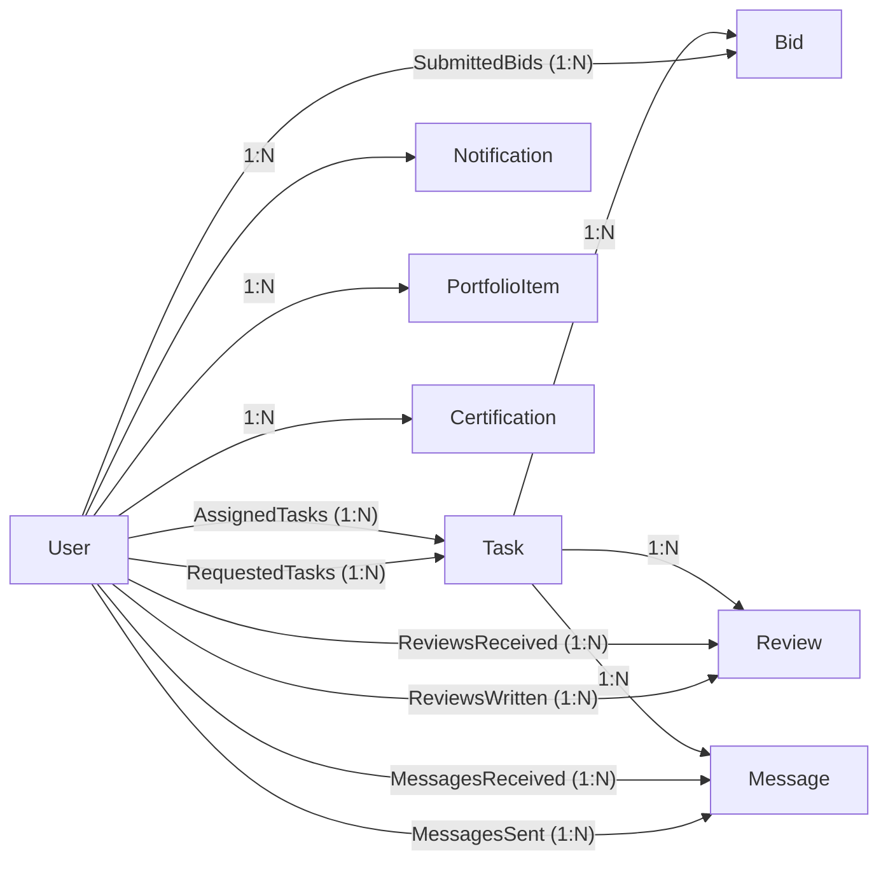

# Database Schema

The system uses PostgreSQL with PostGIS for spatial queries, managed via Prisma ORM.

## 1. Enums
* `Category`: ELECTRICITY, PLUMBING, CARPENTRY, PAINTING, MOVING, GENERAL
* `TaskStatus`: OPEN, IN_PROGRESS, COMPLETED, CANCELED
* `BidStatus`: PENDING, ACCEPTED, REJECTED, WITHDRAWN
* `NotificationType`: NEW_BID, BID_ACCEPTED, BID_REJECTED, NEW_MESSAGE, TASK_COMPLETED, TASK_CANCELED

## 2. Entities

### User
Represents the unified account for both Requesters and Fixers. Created in the database when a user first registers through Firebase Auth.
* `id` (UUID, PK)
* `firebase_uid` (String, Unique) - The UID from Firebase Auth, used to link the Firebase account to the local DB record
* `full_name` (String)
* `email` (String, Unique)
* `phone_number` (String, Unique, Nullable)
* `avatar_url` (String, Nullable)
* `bio` (Text, Nullable)
* `payment_link` (String, Nullable) - Bit/Paybox URL
* `specializations` (Enum: Category[]) - Categories the Fixer works in (e.g., [ELECTRICITY, PLUMBING]). Multi-select, optional. Used for profile display and future smart recommendations.
* `push_token` (String, Nullable) - Device push notification token, registered on app launch. For the initial mobile MVP this stores the Expo push token used by the notification service.
* `average_rating_as_fixer` (Float, Default 0) - Recalculated on each new review submission.
* `created_at` (Timestamp)
* `updated_at` (Timestamp)

> **Note:** Password hashing, email verification status, and session/token management are all handled by Firebase Auth — not stored in this database. The backend queries Firebase when it needs `emailVerified` status.

### Task
The job created by a Requester.
* `id` (UUID, PK)
* `requester_id` (UUID, FK -> User.id)
* `title` (String)
* `description` (Text)
* `media_urls` (String[]) - Firebase Storage URLs. Maximum 5 items enforced at the application layer.
* `category` (Enum: Category)
* `suggested_price` (Float, Nullable) - Null means "Quote Required"
* `status` (Enum: TaskStatus)
* `general_location_name` (String) - Public
* `exact_address` (String) - Hidden until bid accepted
* `coordinates` (Geometry Point) - PostGIS for map/distance queries. **Must have a GIST spatial index** for `ST_DWithin` radius queries to be performant.
* `assigned_fixer_id` (UUID, FK -> User.id, Nullable)
* `is_payment_confirmed` (Boolean, Default false) - Set to true when Requester taps "Confirm Payment" after paying via Bit/Paybox. Separate from `COMPLETED` status, which marks work as done.
* `completed_at` (Timestamp, Nullable) - Set when the Requester marks the task as `COMPLETED`. Used to enforce the 14-day review window.
* `created_at` (Timestamp)
* `updated_at` (Timestamp)

### Bid
The offer submitted by a Fixer.
* `id` (UUID, PK)
* `task_id` (UUID, FK -> Task.id)
* `fixer_id` (UUID, FK -> User.id)
* `offered_price` (Float)
* `description` (Text) - Fixer's pitch
* `status` (Enum: BidStatus)
* `created_at` (Timestamp)
* `updated_at` (Timestamp) - Tracks when status last changed (e.g., when bid was accepted/rejected).

### Review
The Requester rates the Fixer after task completion.
* `id` (UUID, PK)
* `task_id` (UUID, FK -> Task.id)
* `reviewer_id` (UUID, FK -> User.id) - Always the Requester.
* `reviewee_id` (UUID, FK -> User.id) - Always the Fixer (`assigned_fixer_id`).
* `rating` (Integer, 1-5)
* `comment` (Text, Nullable)
* `created_at` (Timestamp)

> **Review window:** Reviews can only be submitted within **14 days** of the task reaching `COMPLETED` status. After this window, the review prompt is hidden and the endpoint rejects submissions. One review per task, enforced by a unique constraint on `task_id + reviewer_id`.

### Message
Powers real-time in-app chat.
* `id` (UUID, PK)
* `task_id` (UUID, FK -> Task.id)
* `sender_id` (UUID, FK -> User.id)
* `recipient_id` (UUID, FK -> User.id)
* `content` (Text)
* `is_read` (Boolean, Default false)
* `created_at` (Timestamp)

### Notification
Alerts for bids, status updates, and messages.
* `id` (UUID, PK)
* `user_id` (UUID, FK -> User.id)
* `title` (String)
* `body` (Text)
* `type` (Enum: NotificationType)
* `related_entity_id` (UUID) - ID of the linked entity. The entity type is determined by the notification type (see mapping below).
* `related_entity_type` (String) - The entity type for deep-linking: `TASK`, `BID`, or `MESSAGE`. Mapping by notification type:
  * `NEW_BID` → `TASK` (navigate to Task Details, Bids tab)
  * `BID_ACCEPTED` / `BID_REJECTED` → `BID` (navigate to My Bids)
  * `NEW_MESSAGE` → `MESSAGE` (navigate to Chat)
  * `TASK_COMPLETED` / `TASK_CANCELED` → `TASK` (navigate to Task Details)
* `is_read` (Boolean, Default false)
* `created_at` (Timestamp)

### PortfolioItem
Visual gallery of past completed jobs for Fixers.
* `id` (UUID, PK)
* `fixer_id` (UUID, FK -> User.id)
* `image_url` (String)
* `description` (String, Nullable)
* `created_at` (Timestamp)

### Certification
Professional credentials uploaded by Fixers. Displayed as-is with no platform verification — no status tracking.
* `id` (UUID, PK)
* `fixer_id` (UUID, FK -> User.id)
* `title` (String)
* `document_url` (String)
* `created_at` (Timestamp)

## 3. Entity Relationships Mapping

The following diagram illustrates the primary connections and dependencies between the system entities.

### Visual Diagram
[View Interactive Graph in FigJam](https://www.figma.com/online-whiteboard/create-diagram/98992f5d-ee75-499b-afcd-e972921c4123?utm_source=other&utm_content=edit_in_figjam&oai_id=&request_id=ab59fac5-0611-46c9-9a48-9cf8046d734b)

### Mermaid Syntax

