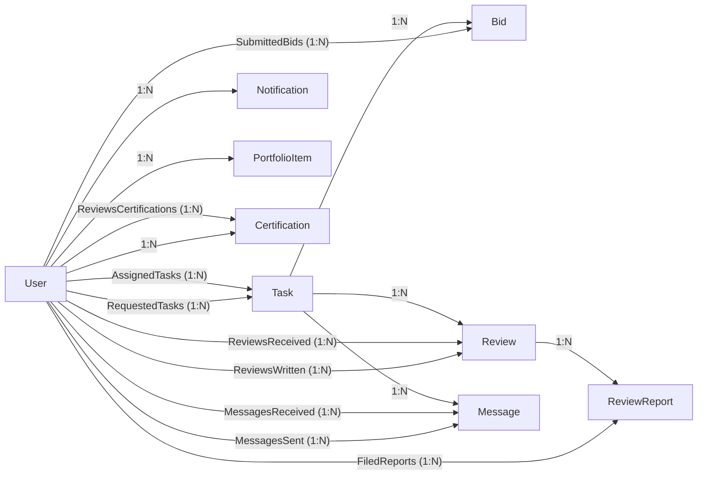

# Database Schema

The system uses PostgreSQL with PostGIS for spatial queries, managed via Prisma ORM. This page
mirrors `backend/prisma/schema.prisma` — if the two ever disagree, the Prisma schema wins.

## 1. Enums

* `Category`: ASSEMBLY, MOUNTING, MOVING, PAINTING, PLUMBING, ELECTRICITY, OUTDOORS, CLEANING, OTHER
* `TaskStatus`: OPEN, IN_PROGRESS, COMPLETED, CANCELED
* `TaskUrgency`: FLEXIBLE, THIS_WEEK, TODAY
* `BidStatus`: PENDING, ACCEPTED, REJECTED, WITHDRAWN
* `BidRejectionReason`: PRICE_TOO_HIGH, BAD_TIMING, CHOSE_ANOTHER, NOT_QUALIFIED, TASK_CANCELED, OTHER
* `ReportReason`: SPAM, OFFENSIVE, MISLEADING, OTHER
* `NotificationType`: NEW_BID, BID_ACCEPTED, BID_REJECTED, BID_WITHDRAWN, NEW_MESSAGE, TASK_COMPLETED, TASK_CANCELED, VERIFICATION_APPROVED, VERIFICATION_REJECTED, CERTIFICATION_APPROVED, CERTIFICATION_REJECTED
* `VerificationStatus`: NONE, PENDING, APPROVED, REJECTED — a Fixer's identity-verification state
* `CertificationStatus`: PENDING, APPROVED, REJECTED — admin-review state of an uploaded credential

## 2. Entities

### User
Represents the unified account for both Requesters and Fixers. Created in the database when a user first registers through Firebase Auth.
* `id` (UUID, PK)
* `firebase_uid` (String, Unique) - The UID from Firebase Auth, used to link the Firebase account to the local DB record
* `full_name` (String)
* `email` (String, Unique)
* `phone_number` (String, Unique, Nullable)
* `avatar_url` (String, Nullable)
* `bio` (Text, Nullable)
* `payment_link` (String, Nullable) - Bit/Paybox URL
* `specializations` (Category[]) - Categories the Fixer works in (e.g., [ELECTRICITY, PLUMBING]). Multi-select, optional.
* `push_token` (String, Nullable) - Expo push token, registered on app launch. Used by the notification service.
* `language` (String, Default `"en"`) - Persisted UI language preference (`"en"` | `"he"`), synced across devices.
* `average_rating_as_fixer` (Float, Default 0) - Recalculated on each new review.
* `completed_tasks_as_fixer` (Int, Default 0)
* `avg_response_time_minutes` (Float, Nullable)
* `verification_status` (VerificationStatus, Default NONE) - Identity-verification state, set by admin review.
* `verification_photo_url` (String, Nullable) - ID document submitted for verification.
* `verification_selfie_url` (String, Nullable) - Selfie submitted for verification.
* `is_fixer` (Boolean, Default false)
* `is_admin` (Boolean, Default false)
* `email_verified` (Boolean, Default false) - Mirrored from Firebase so the backend can gate without a Firebase round-trip.
* `created_at` / `updated_at` (Timestamps)

> **Note:** Passwords and session/token management are handled by Firebase Auth — never stored here. `email_verified` is mirrored into the DB (synced from Firebase) so the backend can read it directly.

### Task
The job created by a Requester.
* `id` (UUID, PK)
* `requester_id` (UUID, FK → User.id)
* `title` (String)
* `description` (Text)
* `media_urls` (String[]) - Firebase Storage URLs. Max 5 enforced at the application layer.
* `category` (Category)
* `suggested_price` (Float, Nullable) - Null means "Quote Required"
* `urgency` (TaskUrgency, Default FLEXIBLE)
* `status` (TaskStatus, Default OPEN)
* `general_location_name` (String) - Public neighborhood-level name
* `general_location_name_en` (String, Nullable) - English geocoding of the public location
* `exact_address` (String) - Hidden until a bid is accepted
* `exact_address_en` (String, Nullable) - English geocoding of the exact address
* `coordinates` (Geometry(Point, 4326)) - PostGIS, with a **GiST spatial index** for `ST_DWithin` radius queries
* `assigned_fixer_id` (UUID, FK → User.id, Nullable)
* `completion_photos` (String[]) - Photos of finished work
* `is_payment_confirmed` (Boolean, Default false) - Requester confirmed payment via Bit/Paybox. Separate from `COMPLETED`.
* `requester_completed` (Boolean, Default false) - Requester's side of the two-sided completion handshake
* `fixer_completed` (Boolean, Default false) - Fixer's side of the handshake
* `fixer_completed_at` (Timestamp, Nullable)
* `completed_at` (Timestamp, Nullable) - Set when the task reaches `COMPLETED`. Enforces the 14-day review window.
* `created_at` / `updated_at` (Timestamps)

> **Two-sided completion:** a task moves to `COMPLETED` once both `requester_completed` and `fixer_completed` are set. Either party can confirm first; the second confirmation finalizes it. Bilingual location fields (`*_en`) support the English/Hebrew UI.

### Bid
The offer submitted by a Fixer.
* `id` (UUID, PK)
* `task_id` (UUID, FK → Task.id)
* `fixer_id` (UUID, FK → User.id)
* `offered_price` (Float)
* `description` (Text) - Fixer's pitch
* `status` (BidStatus, Default PENDING)
* `rejection_reason` (BidRejectionReason, Nullable) - Why the bid was rejected (manual or auto)
* `rejection_note` (String, Nullable) - Optional free-text note on rejection
* `auto_rejected_winning_price` (Float, Nullable) - When auto-rejected because another bid was accepted, the winning bid's price (shown to the Fixer for context)
* `auto_rejected_winning_rating` (Float, Nullable) - The winning Fixer's rating, for the same context
* `created_at` / `updated_at` (Timestamps)
* Unique on `task_id + fixer_id` (one bid per Fixer per task)

### Review
The Requester rates the Fixer after task completion.
* `id` (UUID, PK)
* `task_id` (UUID, FK → Task.id)
* `reviewer_id` (UUID, FK → User.id) - Always the Requester
* `reviewee_id` (UUID, FK → User.id) - Always the Fixer
* `rating` (Integer, 1–5)
* `comment` (Text, Nullable)
* `is_flagged` (Boolean, Default false) - Set when reported; surfaces in the admin moderation queue
* `is_hidden` (Boolean, Default false) - Set by an admin to hide an abusive review
* `created_at` (Timestamp)
* Unique on `task_id + reviewer_id`

> **Review window:** reviews can only be submitted within **14 days** of the task reaching `COMPLETED`. One review per task.

### ReviewReport
A report filed against a review, feeding the admin moderation queue.
* `id` (UUID, PK)
* `review_id` (UUID, FK → Review.id)
* `reporter_id` (UUID, FK → User.id)
* `reason` (ReportReason)
* `details` (String, Nullable)
* `created_at` (Timestamp)
* Unique on `review_id + reporter_id` (one report per user per review)

### Message
Powers real-time in-app chat.
* `id` (UUID, PK)
* `task_id` (UUID, FK → Task.id)
* `sender_id` (UUID, FK → User.id)
* `recipient_id` (UUID, FK → User.id)
* `content` (Text)
* `is_read` (Boolean, Default false) - Drives read receipts
* `created_at` (Timestamp)

### Notification
Alerts for bids, status updates, messages, and verification/certification outcomes.
* `id` (UUID, PK)
* `user_id` (UUID, FK → User.id)
* `title` (String) / `body` (Text)
* `type` (NotificationType)
* `related_entity_id` (String) - ID of the linked entity, for deep-linking
* `related_entity_type` (String) - `TASK`, `BID`, or `MESSAGE`
* `user_role` (String, Nullable) - Which role context (requester/fixer) the notification targets
* `is_read` (Boolean, Default false)
* `created_at` (Timestamp)

### PortfolioItem
Visual gallery of past completed jobs for Fixers.
* `id` (UUID, PK)
* `fixer_id` (UUID, FK → User.id)
* `image_url` (String)
* `description` (String, Nullable)
* `created_at` (Timestamp)

### Certification
Professional credentials uploaded by Fixers and reviewed by an admin.
* `id` (UUID, PK)
* `fixer_id` (UUID, FK → User.id)
* `category` (Category) - Trade the credential applies to
* `title` (String)
* `document_url` (String)
* `status` (CertificationStatus, Default PENDING) - Admin-review state
* `reviewed_at` (Timestamp, Nullable)
* `reviewed_by` (UUID, FK → User.id, Nullable) - The admin who reviewed it
* `rejection_note` (String, Nullable)
* `created_at` / `updated_at` (Timestamps)
* Unique on `fixer_id + category`

> Certifications are **admin-reviewed**: a Fixer uploads a credential (status `PENDING`), and an admin approves or rejects it. Approved certifications surface as trusted badges on the public profile.

## 3. Entity Relationships

```mermaid
graph LR
    User["User"]
    Task["Task"]
    Bid["Bid"]
    Review["Review"]
    ReviewReport["ReviewReport"]
    Message["Message"]
    Notification["Notification"]
    PortfolioItem["PortfolioItem"]
    Certification["Certification"]

    User --"RequestedTasks (1:N)"--> Task
    User --"AssignedTasks (1:N)"--> Task
    User --"SubmittedBids (1:N)"--> Bid
    User --"ReviewsWritten (1:N)"--> Review
    User --"ReviewsReceived (1:N)"--> Review
    User --"MessagesSent (1:N)"--> Message
    User --"MessagesReceived (1:N)"--> Message
    User --"1:N"--> Notification
    User --"1:N"--> PortfolioItem
    User --"1:N"--> Certification
    User --"FiledReports (1:N)"--> ReviewReport
    User --"ReviewsCertifications (1:N)"--> Certification

    Task --"1:N"--> Bid
    Task --"1:N"--> Review
    Task --"1:N"--> Message
    Review --"1:N"--> ReviewReport
```
