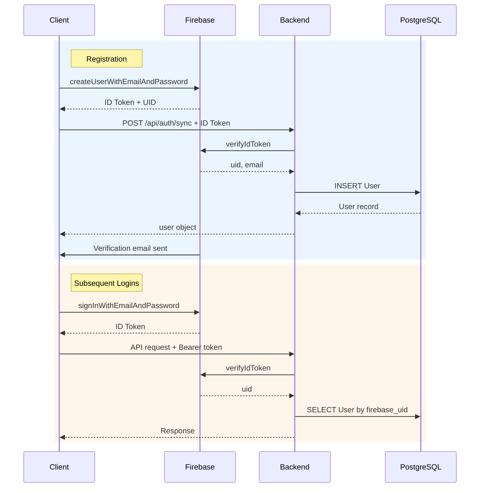
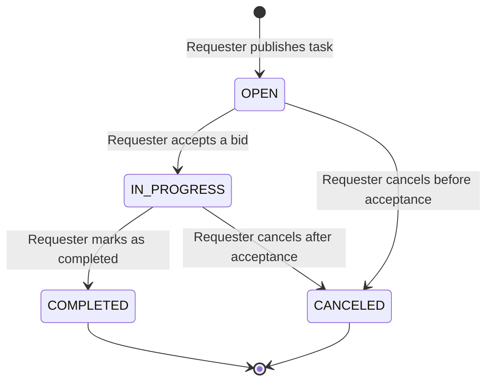
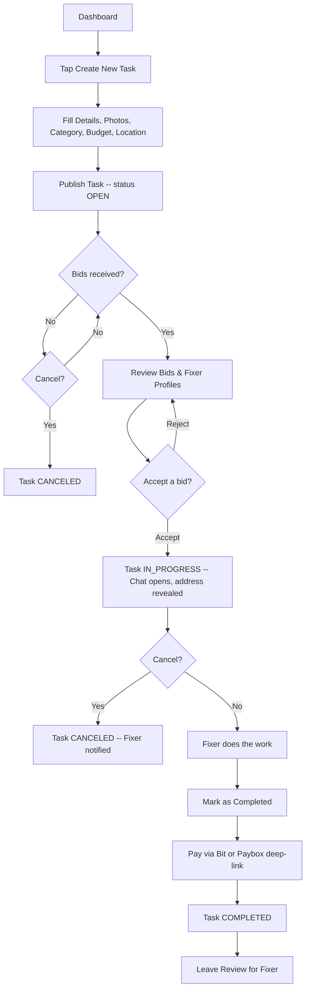
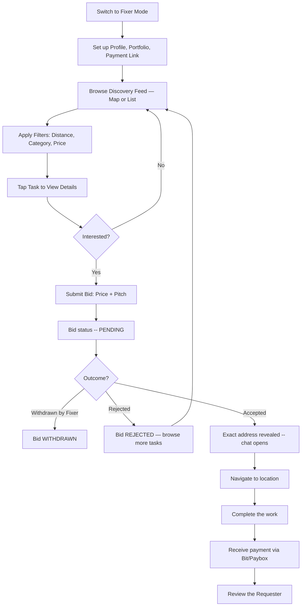
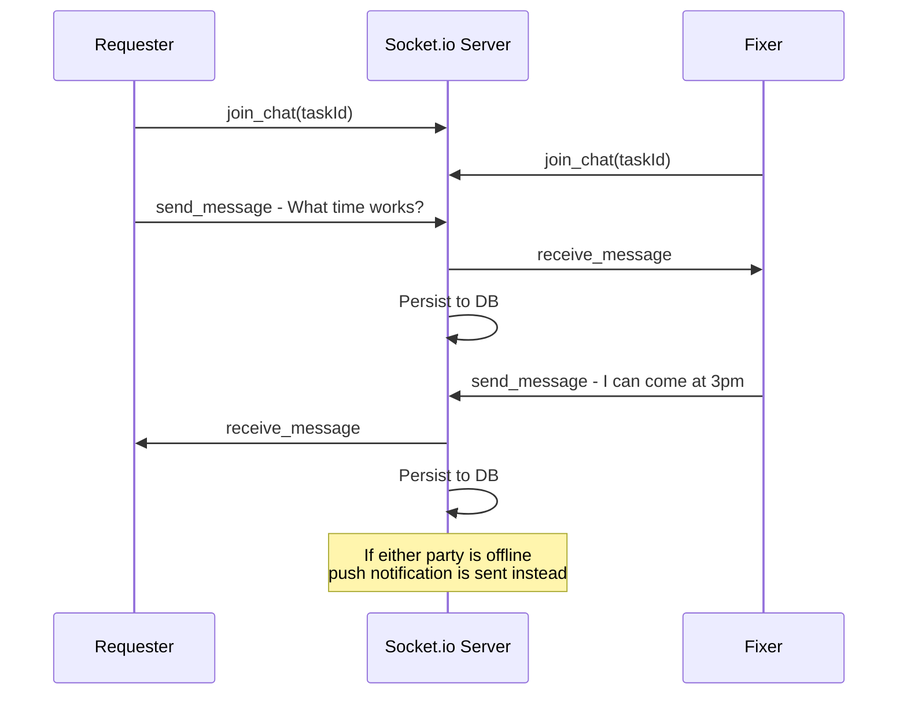

# User Flows

## 1. Onboarding & Authentication

### 1.1 Registration

1. User downloads app / opens web platform.
2. Selects language (English/Hebrew).
3. Taps "Create Account".
4. Enters Full Name, Email, Password (with confirmation), and optionally a Phone Number.
5. Client calls Firebase `createUserWithEmailAndPassword()`. On success, Firebase returns a signed-in user with an ID Token.
6. Client immediately calls `POST /api/auth/sync` (with the Firebase ID Token) to create the local User record in PostgreSQL with the provided `full_name` and `phone_number`.
7. Firebase sends a verification email via `sendEmailVerification()`. A banner on the dashboard prompts the user to verify. The app is fully usable before verification, but an "Email Verified" badge is only shown on their profile once confirmed.
8. Fills out basic profile (Avatar, Bio) — can be skipped and completed later.
9. Lands on the main dashboard in Requester mode by default.

### 1.2 Login

1. User opens app / web platform.
2. Enters Email and Password.
3. Client calls Firebase `signInWithEmailAndPassword()`.
4. On success, Firebase returns an ID Token. User lands on the dashboard.
5. On failure, the client displays the Firebase error message inline (e.g., "Invalid email or password").

### 1.3 Password Reset

1. User taps "Forgot Password?" on the Login screen.
2. Enters their registered email address.
3. Client calls Firebase `sendPasswordResetEmail()`.
4. User sees a confirmation: "Check your inbox for a reset link."
5. User follows the link (handled by Firebase), sets a new password, and returns to the Login screen.

### 1.4 Session Persistence

* Firebase SDK automatically persists the auth session on the device.
* On app launch, the SDK checks for an existing session and silently refreshes the ID Token if needed.
* If a valid session exists, the user sees the dashboard directly (no login screen).
* If no session exists, the user is redirected to the Login screen.

### 1.5 Logout

* User taps "Log Out" in Settings.
* Client calls Firebase `signOut()`. Local session is cleared.
* User is returned to the Login screen.

### Authentication Flow Diagram

---

## 2. Task Lifecycle

Every task follows a defined state machine. The diagram below shows all valid transitions and who triggers them.

**Transition Rules:**

| From | To | Triggered By | Side Effects |
|---|---|---|---|
| — | OPEN | Requester creates task | Task visible on discovery feed |
| OPEN | IN_PROGRESS | Requester accepts a bid | Fixer assigned, exact address revealed to Fixer, all other PENDING bids auto-rejected, chat channel activated |
| OPEN | CANCELED | Requester cancels | All PENDING bids auto-rejected, task removed from feed |
| IN_PROGRESS | COMPLETED | Requester marks completed | Payment prompt shown, review prompts sent to both parties |
| IN_PROGRESS | CANCELED | Requester cancels | Fixer notified, review prompt still sent to Fixer (to flag bad Requesters) |

---

## 3. The Requester Flow

### 3.1 Task Creation

1. Taps the "+" floating action button or "Create New Task" card.
2. **Step 1 — Details:** Enters Title and Description.
3. **Step 2 — Media:** Uploads up to 5 photos from camera or gallery.
4. **Step 3 — Category:** Selects one category (Electricity, Plumbing, Carpentry, Painting, Moving, General).
5. **Step 4 — Budget:** Chooses one of:
   * **Fixed Price** — enters a specific amount.
   * **Quote Required** — leaves price blank, expects Fixers to name their price.
6. **Step 5 — Location:**
   * Drops a pin on the map for the **general area** (shown publicly on the discovery feed).
   * Enters the **exact street address** privately (hidden until a bid is accepted).
7. Reviews the summary and taps "Publish".
8. Task status is set to `OPEN` and appears on the Fixer discovery feed.

### 3.2 Reviewing Bids

1. Receives a push notification when a new bid arrives.
2. Opens the Task Details screen → "Bids" tab.
3. Sees a list of bid cards, each showing: Fixer avatar, name, rating, offered price, and a snippet of their pitch.
4. Taps a bid card to view the Fixer's full profile: bio, portfolio gallery, certifications, past reviews.
5. Can accept one bid or reject individual bids.

### 3.3 Accepting a Bid

1. Taps "Accept" on the preferred bid.
2. System confirms: "Accept this bid for ₪[price]?"
3. On confirmation:
   * Task status → `IN_PROGRESS`.
   * `assigned_fixer_id` is set.
   * Exact address is revealed to the assigned Fixer.
   * All other `PENDING` bids are auto-rejected.
   * Fixer receives a push notification: "Your bid was accepted!"
   * Chat channel between Requester and Fixer becomes active.

### 3.4 Coordinating via Chat

1. After bid acceptance, the Requester can open the chat from the Task Details screen.
2. Uses real-time messaging to coordinate timing, special instructions, or share additional photos.
3. Chat is scoped to the specific task — one chat thread per task.

### 3.5 Completion & Payment

1. Once the Fixer finishes the work, the Requester taps "Mark as Completed".
2. A "Pay Fixer" button appears, which deep-links to the Fixer's Bit/Paybox app with the agreed amount.
3. After paying externally, the Requester taps "Confirm Payment".
4. Task status → `COMPLETED`.
5. Both parties receive a prompt to leave a review.

### 3.6 Rating the Fixer

1. After task completion, a review prompt appears (also accessible from Past Tasks).
2. Requester selects 1–5 stars and optionally writes a comment.
3. Submits the review. The Fixer's `average_rating_as_fixer` is recalculated.
4. Reviews can only be submitted once per task and cannot be edited.

### 3.7 Canceling a Task

**Before a bid is accepted (status: OPEN):**
1. Requester opens Task Details → taps "Cancel Task".
2. Confirms the action.
3. All `PENDING` bids are auto-rejected. Bidding Fixers receive a notification: "Task was canceled."
4. Task status → `CANCELED`. Removed from the discovery feed.

**After a bid is accepted (status: IN_PROGRESS):**
1. Requester opens Task Details → taps "Cancel Task".
2. A warning is shown: "A Fixer has already been assigned. Are you sure?"
3. On confirmation:
   * Task status → `CANCELED`.
   * Fixer receives a notification: "The task was canceled by the Requester."
   * The Fixer is still prompted to leave a review for the Requester (to flag unreliable Requesters).

### Requester Flow Diagram

---

## 4. The Fixer Flow

### 4.1 Profile Setup (Optional but Recommended)

1. Switches to Fixer mode via the top navigation toggle.
2. Opens Profile → "Edit Profile".
3. Adds a Bio describing their skills and experience.
4. Uploads Portfolio photos of past work (gallery of images with optional captions).
5. Uploads Certifications (professional credentials displayed on profile).
6. Adds their personal Bit/Paybox payment link (required to receive payments).

### 4.2 Task Discovery

1. Opens the "Find Jobs" screen (default in Fixer mode).
2. Toggles between **Map View** (pins on Google Maps) and **List View** (sorted cards).
3. Applies filters via horizontal chips:
   * **Distance:** within 5km / 10km / 25km / 50km.
   * **Category:** one or more categories.
   * **Price:** minimum and/or maximum budget range.
4. Taps a task pin (map) or card (list) to view the Task Details preview.

### 4.3 Viewing Task Details

1. Sees: title, description, photos, category, budget (or "Quote Required"), general location on map, and the Requester's rating.
2. Exact address is **not visible** at this stage.
3. Can tap the Requester's name to view their public profile and reviews.

### 4.4 Submitting a Bid

1. Taps "Submit Bid" at the bottom of the Task Details screen.
2. A modal opens with:
   * **Price Offer** — numeric input for their proposed price.
   * **Pitch Message** — text area to explain why they're a good fit.
3. Taps "Send Offer". Bid status is set to `PENDING`.
4. The Requester receives a push notification about the new bid.
5. A Fixer can only submit **one bid per task** (enforced by a unique constraint on `task_id + fixer_id`).

### 4.5 Tracking Submitted Bids

1. Opens "My Bids" from the Fixer dashboard or bottom tab navigation.
2. Sees a list of all submitted bids, grouped by status:
   * **Pending** — waiting for the Requester's decision.
   * **Accepted** — assigned to this Fixer.
   * **Rejected** — declined by the Requester.
   * **Withdrawn** — canceled by the Fixer.
3. Taps a bid to view the associated task and current status.

### 4.6 Bid Accepted — Job Execution

1. Receives a push notification: "Your bid was accepted!"
2. Opens the task — exact address is now visible.
3. Taps the address to open in Google Maps / Waze for navigation.
4. Uses in-app chat to coordinate with the Requester ("On my way", "I'm 5 mins away").
5. Arrives and completes the physical work.

### 4.7 Post-Job: Payment & Review

1. Receives payment externally via Bit/Paybox.
2. Receives a prompt to rate the Requester (1–5 stars + optional comment).
3. Review is submitted. The Requester's `average_rating_as_requester` is recalculated.

### 4.8 Withdrawing a Bid

1. From "My Bids", the Fixer taps a `PENDING` bid → "Withdraw Bid".
2. Confirms the action.
3. Bid status → `WITHDRAWN`. The Requester is notified.
4. A bid can only be withdrawn while it is still `PENDING` (not after acceptance).

### Fixer Flow Diagram

---

## 5. Shared Flows

### 5.1 Mode Switching

1. The top navigation bar contains a toggle: **Requester** ↔ **Fixer**.
2. Tapping the toggle switches the entire UI context:
   * **Requester mode:** Dashboard shows "My Tasks", bottom tabs show Home / Create Task / Messages / Profile.
   * **Fixer mode:** Dashboard shows Discovery Feed, bottom tabs show Find Jobs / My Bids / Messages / Profile.
3. The switch is instant — no data is lost. Both modes share the same user account.
4. Unread notification counts persist across modes (a Fixer notification badge is still visible in Requester mode).

### 5.2 Real-Time Chat

**When is chat available?**
* A chat channel for a task is only activated **after a bid is accepted** (task status: `IN_PROGRESS`).
* Only the Requester and the assigned Fixer can participate — no other users.

**Chat flow:**
1. Either party opens the task → taps "Chat".
2. Client joins the Socket.io room `task_chat_{taskId}`.
3. Messages are sent in real-time via WebSocket events.
4. Messages are persisted to the database (Message table) for history.
5. If the other party is offline, they receive a push notification for each new message.
6. Chat history is loaded via `GET /api/tasks/:id/messages` on first open (paginated, newest last).

**Chat availability by task status:**
| Task Status | Chat Available? |
|---|---|
| OPEN | No |
| IN_PROGRESS | Yes (active) |
| COMPLETED | Yes (read-only archive) |
| CANCELED | No (hidden) |

### 5.3 Conversation List

1. User opens the "Messages" tab (available in both modes).
2. Sees a list of all active chat threads, each showing:
   * Task title.
   * Other party's name and avatar.
   * Last message preview and timestamp.
   * Unread message count badge.
3. Threads are sorted by most recent message.
4. Tapping a thread opens the full Chat Interface.

### 5.4 Notifications

**What triggers a notification?**

| Event | Recipient | Notification Type |
|---|---|---|
| New bid submitted on a task | Requester (task owner) | `NEW_BID` |
| Bid accepted | Fixer (bid owner) | `BID_ACCEPTED` |
| Bid rejected | Fixer (bid owner) | `BID_REJECTED` |
| New chat message (recipient offline) | Other party | `NEW_MESSAGE` |
| Task marked as completed | Fixer | `TASK_COMPLETED` |
| Task canceled | Fixer (if assigned) / all bidders (if OPEN) | `TASK_CANCELED` |

**Notification flow:**
1. Server-side event triggers a notification record in the DB + a push notification via Firebase Cloud Messaging.
2. Client receives the push notification (even if app is backgrounded).
3. Tapping the notification deep-links to the relevant screen (task details, chat, or bid).
4. In-app, the notification bell icon shows an unread count badge.
5. Opening the Notifications screen shows a chronological list. Tapping an item marks it as read and navigates to the relevant entity.

### 5.5 Profile Management

1. User opens "Profile" from the bottom tab navigation.
2. Sees their profile as others see it: avatar, name, rating, bio.
3. Taps "Edit Profile" to update:
   * **Avatar** — upload a new photo.
   * **Full Name** — editable text.
   * **Bio** — free-text description.
   * **Phone Number** — editable.
   * **Payment Link** — Bit/Paybox URL (primarily for Fixer mode).
4. Fixer-specific sections (visible when in Fixer mode or always accessible):
   * **Portfolio** — add/remove photos of past work.
   * **Certifications** — upload/remove professional credentials.
5. Profile changes are saved via `PUT /api/users/me`.

### 5.6 Review System Rules

* Reviews can only be submitted **after a task reaches `COMPLETED` status**.
* Exception: If a task is canceled while `IN_PROGRESS`, the Fixer can still review the Requester.
* Each party submits **one review per task** (enforced by unique constraint on `task_id + reviewer_id`).
* Reviews are **permanent** — they cannot be edited or deleted.
* Both reviews are independent — neither party can see the other's review until both have submitted (or 7 days have passed, whichever comes first).
* The reviewee's average rating is recalculated on each new review submission.
