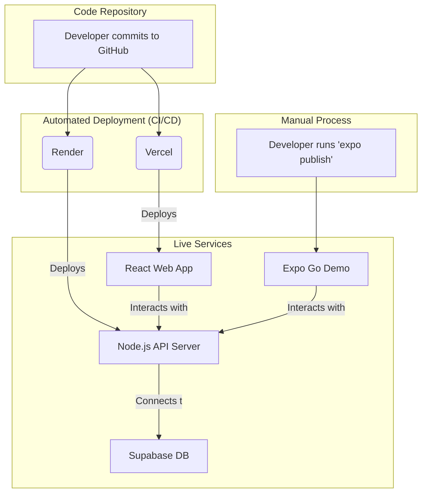

# Development Phases & Planning

To ensure a smooth delivery of the MVP, the project should be broken down into structured phases.

## Phase 1: Foundation & Setup
* **Repository Setup:** Initialize monorepo or separate repos for Frontend (Expo) and Backend (Node.js).
* **Database Provisioning:** Set up PostgreSQL with PostGIS extension.
* **Prisma Setup:** Define the `schema.prisma` file based on the Database Schema doc and run initial migrations.
* **Basic CI/CD:** Set up linting, formatting (Prettier), and basic GitHub Actions.

## Phase 2: Backend Core & Authentication
* **Firebase Project Setup:** Create a Firebase project. Enable Email/Password sign-in in the Firebase Console. Download the service account key for the backend (`firebase-admin`).
* **Auth Middleware:** Create `authMiddleware` using `firebase-admin` SDK to call `admin.auth().verifyIdToken(token)` on every protected route. Look up the local User by `firebase_uid` and attach to `req.user`.
* **Sync Endpoint:** Implement `POST /api/auth/sync` — called once after client-side Firebase registration to create the local User record in PostgreSQL (receives `full_name`, `phone_number`; extracts `uid` and `email` from the verified Firebase token).
* **User Profiles:** CRUD operations for User entities, including portfolio and certifications.
* **Cloud Storage Integration:** Set up AWS S3 or Firebase Storage for image uploads.

## Phase 3: Task & Bidding Engine
* **Task Management:** Endpoints for creating, reading, and updating tasks.
* **Geospatial Queries:** Implement PostGIS queries to fetch tasks within a specific radius.
* **Bidding Logic:** Endpoints for Fixers to submit bids and Requesters to accept/reject them.
* **State Machine:** Ensure proper status transitions (OPEN -> IN_PROGRESS -> COMPLETED).

## Phase 4: Frontend Core (Mobile & Web)
* **Firebase Client SDK:** Initialize `firebase/auth` in the Expo app. Implement Registration, Login, Logout, and Email Verification screens using the Firebase JS SDK. Set up an auth state listener (`onAuthStateChanged`) to manage session persistence and route guarding.
* **Navigation:** Implement React Navigation (Expo) with the Mode Toggle (Requester/Fixer). Auth screens shown when no session, main app shown when authenticated.
* **UI Components:** Build reusable components (Buttons, Inputs, Cards, Avatars).
* **Screens - Requester:** Build Task Creation flow and Dashboard.
* **Screens - Fixer:** Build Map/List Discovery feed and Bid Submission modal.
* **API Integration:** Connect frontend to backend using Axios or React Query. Attach Firebase ID Token to every request via an Axios interceptor (`getIdToken()`).

## Phase 5: Real-Time Features & Trust
* **WebSockets:** Integrate Socket.io for the in-app chat feature.
* **Reviews:** Implement the two-way rating system endpoints and UI.
* **Notifications:** Set up Firebase Cloud Messaging for push alerts.

## Phase 6: Polish, Localization & Testing
* **Bilingual Support:** Implement i18n for English and Hebrew toggling (handling RTL layouts).
* **Payment Deep-links:** Implement the Bit/Paybox URL generation and redirection.
* **Seeding:** Create a robust seed script to populate the database with mock users, tasks, and bids in a specific geographical area for the final presentation.
* **Testing:** End-to-end testing of the core user flows.

## Phase 7: Deployment & Presentation Prep
This is the critical stage where all components come together. The following steps ensure a smooth deployment and a successful presentation.

### A. General Preparations
*   **Environment Variable Management:** Configure all secrets (DB connection strings, API keys) in the hosting provider's secrets management UI. Do not commit `.env` files or key files to version control.
*   **CORS Configuration:** In the Node.js Express server, install and configure the `cors` package to explicitly allow requests from the deployed frontend's domain.
*   **Database Seeding:** Ensure the seed script is runnable against the production database. Create an `npm run seed:prod` script in `package.json` to populate the live database with high-quality demo data for the presentation.

### B. Backend Deployment
*   **Platform:** Deploy the Node.js server to a platform like **Render** (recommended for its simplicity and free tier) or Heroku.
*   **`package.json` Scripts:** Verify the `build` script (e.g., `tsc`) and `start` script (e.g., `node dist/server.js`) are correctly configured for the hosting platform.
*   **Health Check:** (Optional but recommended) Add a `GET /api/health` endpoint that returns a `200 OK` status to allow the hosting platform to monitor server status.

### C. Database Hosting
*   **Platform:** Host the PostgreSQL database on a managed service like **Supabase** (recommended for its PostGIS support and free tier) or AWS RDS.
*   **Connection Pooling:** To prevent exhausting connection limits, add the `?pgbouncer=true` parameter to the database connection string when using Supabase.
*   **Security:** Configure the database's firewall rules to allow connections only from the backend server's IP address.

### D. Frontend Deployment
*   **Mobile (Expo Go):** Prepare a QR code for the presentation. Ensure all stakeholders have the Expo Go app installed on their devices for the live demo.
*   **Web (Vercel/Netlify):** Deploy the web version to **Vercel** (recommended for React apps). Connect the Git repository for automatic deployments. Configure environment variables (e.g., `VITE_API_URL`) in the Vercel project settings.

### E. Pre-Presentation Checklist
*   [ ] **Backend Deployed:** The server is live on Render and responsive.
*   [ ] **Frontend Deployed:** The web app is live on Vercel and successfully communicating with the backend.
*   [ ] **Database Seeded:** The production database is populated with demo data.
*   [ ] **Mobile Ready:** The app loads correctly via Expo Go.
*   [ ] **E2E Flow Tested:** A full user flow (e.g., register, create task, bid, accept, chat) has been tested on the live environment.
*   [ ] **Demo Credentials Prepared:** Have dedicated demo user accounts (e.g., "requester@demo.com", "fixer@demo.com") ready for the presentation.

### F. Deployment Flow Diagram

